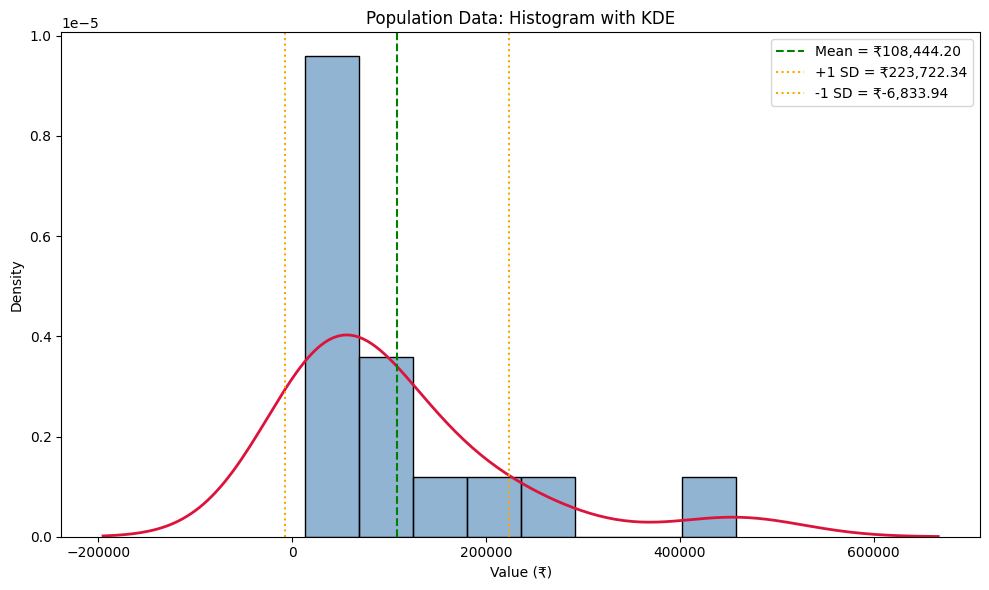
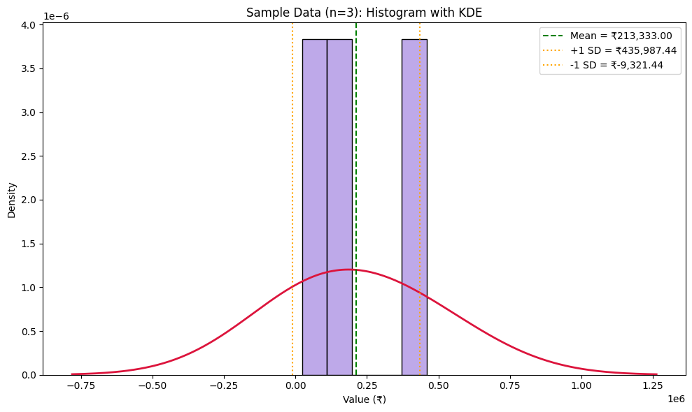
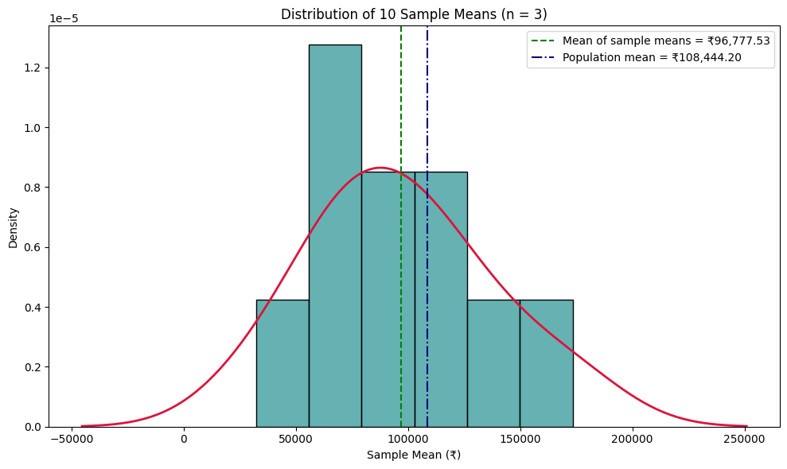
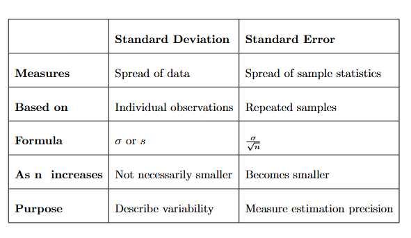
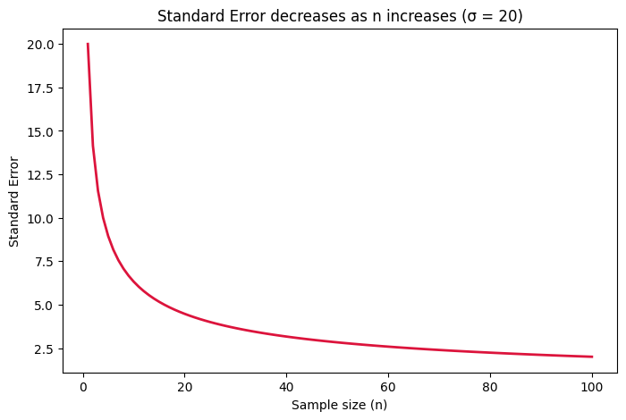
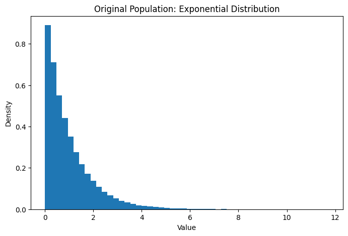
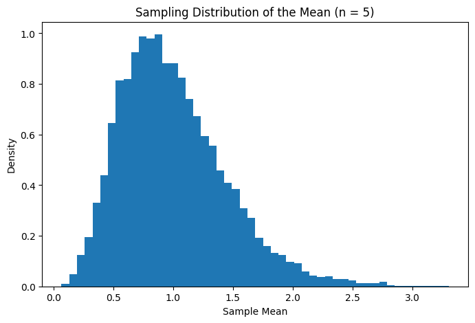
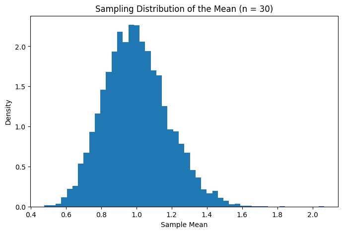
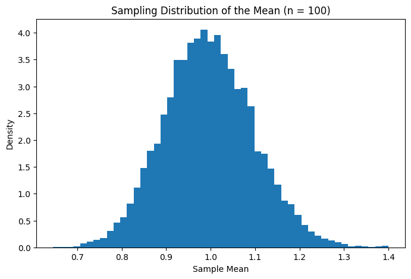
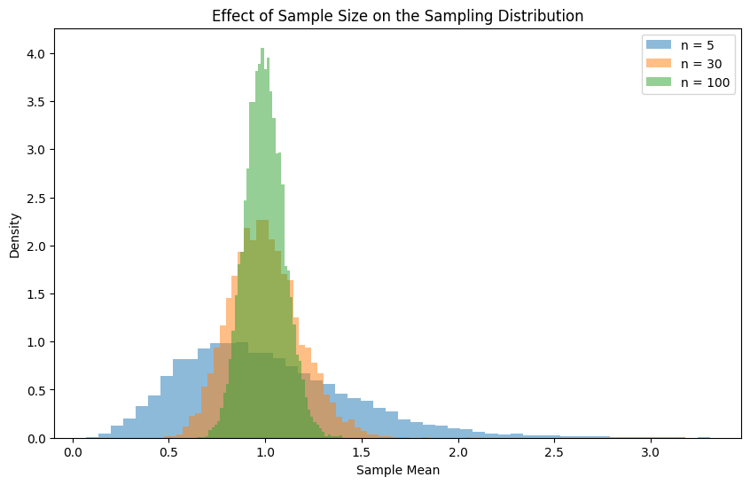

# Can a Small Sample Really Speak for a Whole Population? #

## From population to sample to the normal distribution ##

I have some 100-200 houses in my locality and I was curious to know what the average salary of a household is, so I thought of asking some. 100-200 is a large number to collect data from but 10-20 seems much more realistic, so I asked a few people and I came up with this data set:

$$48333, 120833, 35000, 50833, 13333, 32500, 
23333 , 183333 ,20000 , 60000 , 158333 , 70833 , 93333 , 258333 , 458333$$

Of course, we have rich people here, average ones and below-average ones too, so the variance in the data is self-explanatory. But what if I really want to collect the same data for the whole area, can I do that? Yes, I can, but it will take time and too much work, right? But what if I want to do it for the state I am in, is it possible? Ahhhhhhh........

That's a task, isn't it? It will consume a good amount of time and manpower. That's the whole point. Sometimes it is very difficult to work with the population, it means collecting the data becomes an impossible task. Then what is the solution?

Solutions are often thought of at a small scale first. What if, rather than running for the *population mean*, we run for the *sample mean*? Or instead of observing the *population variance*, we go for the *sample variance*? Similarly, as I did for the average salary, I took a sample out of the population and I will look for the variables from it.

In many real-life scenarios we do it like this, mostly we do not have the population data, so by working with sample data we try to understand the population itself. Isn't it confusing? How are the results supposed to match? How can this be true? But it is. We do not end up getting results exactly the same as our *population data*, but we can get closer to it.

**Population Mean** --> $\mu$

**Population Variance** --> $\sigma^2$

**Sample Mean** --> $\bar{X}$

**Sample Variance** --> $s^2$

Yes, we have different notations for population and sample just to make a proper distinction. And one must be well aware of these while working with the data. 
The important distinction here is that $\mu$ is called a **parameter** and $\bar{X}$ is called a **statistic**.

So the data I collected above is my **sample**, and its mean is my **$\bar{X}$**.

I hope this whole discussion above made one point very clear: **why do we actually need sampling**.

Above I told you that taking the data of the whole area is going to be a task, so it is better we work with the given 15 points. So what if I make these points my **Population Data**, and out of these I take 3 random data points and call it a **Sample Data**.

So $$\mu = \frac{48333+120833+35000+50833+13333+32500+23333+183333+20000+60000+158333+70833+93333+258333+458333}{15}$$

$$=₹108,444.20$$

and

$$ {\sigma^2=13,289,049,004.96} $$

therefore:

Population Mean: ₹108,444.20

Population Variance: 13,289,049,004.96

Population Standard Deviation: ₹115,278.14

```
import numpy as np
import matplotlib.pyplot as plt
import seaborn as sns

data = [48333, 120833, 35000, 50833, 13333, 32500, 23333, 183333,
        20000, 60000, 158333, 70833, 93333, 258333, 458333]

mean = np.mean(data)
std = np.std(data, ddof=0)   # population std

fig, ax = plt.subplots(figsize=(10, 6))
sns.histplot(data, bins=8, stat="density", color="steelblue",
             edgecolor="black", alpha=0.6, ax=ax)
sns.kdeplot(data, color="crimson", linewidth=2, ax=ax)

ax.axvline(mean, color="green", linestyle="--", label=f"Mean = ₹{mean:,.2f}")
ax.axvline(mean + std, color="orange", linestyle=":", label=f"+1 SD = ₹{mean+std:,.2f}")
ax.axvline(mean - std, color="orange", linestyle=":", label=f"-1 SD = ₹{mean-std:,.2f}")

ax.set_title("Population Data: Histogram with KDE")
ax.set_xlabel("Value (₹)")
ax.set_ylabel("Density")
ax.legend()
plt.tight_layout()
plt.show()
```


In the same way, if we take $$158333, 23333, 458333$$ as my sample data, then

$$\bar{X} = \frac{158333+23333+458333}{3}$$

$$=₹213333$$

and 

$$s^2 = 49,575,000,000 $$

therefore,

Sample mean = ₹213,333

Sample variance = 49,575,000,000

Sample standard deviation = ₹222,654.44

```
import numpy as np
import matplotlib.pyplot as plt
import seaborn as sns

sample = [158333, 23333, 458333]

mean = np.mean(sample)
std = np.std(sample, ddof=1)   # sample std (n-1)

fig, ax = plt.subplots(figsize=(10, 6))
sns.histplot(sample, bins=5, stat="density", color="mediumpurple",
             edgecolor="black", alpha=0.6, ax=ax)
sns.kdeplot(sample, color="crimson", linewidth=2, ax=ax, bw_adjust=1.5)

ax.axvline(mean, color="green", linestyle="--", label=f"Mean = ₹{mean:,.2f}")
ax.axvline(mean + std, color="orange", linestyle=":", label=f"+1 SD = ₹{mean+std:,.2f}")
ax.axvline(mean - std, color="orange", linestyle=":", label=f"-1 SD = ₹{mean-std:,.2f}")

ax.set_title("Sample Data (n=3): Histogram with KDE")
ax.set_xlabel("Value (₹)")
ax.set_ylabel("Density")
ax.legend()
plt.tight_layout()
plt.show()
```


Now, can you compare the two results side by side? Did you see the difference? Exactly, which brings us to our next point: why the *sample mean* is so different from the *population mean*. Taking one sample and working on it will not take us close to our population mean, this has to be done a number of times to get closer to the accuracy.

From our data, if we take 10 random samples of 3 points each:

$\{48,333, 120,833, 35,000\} --> \bar{X_1} = 68,055.33$

$\{50,833, 13,333, 32,500\} -->	\bar{X_2} = 32,222.00$

$\{183,333, 20,000, 60,000\} --> \bar{X_3} = 87,777.67$

$\{70,833, 93,333, 258,333\} --> \bar{X_4} = 140,833.00$

$\{458,333, 48,333, 13,333\} --> \bar{X_5} = 173,333.00$

$\{120,833, 32,500, 183,333\} --> \bar{X_6} = 112,222.00$

$\{35,000, 60,000, 93,333\} --> \bar{X_7} = 62,777.67$

$\{158,333, 50,833, 20,000\} --> \bar{X_8} = 76,388.67$

$\{23,333, 70,833, 258,333\} --> \bar{X_9} = 117,499.67$

$\{13,333, 183,333, 93,333\} --> \bar {X_{10}} = 96,666.33$

We can clearly see that all the means are different from each other.

But what if we take mean of all these means?

```
import numpy as np
import matplotlib.pyplot as plt
import seaborn as sns

sample_means = [68055.33, 32222.00, 87777.67, 140833.00, 173333.00,
                112222.00, 62777.67, 76388.67, 117499.67, 96666.33]

pop_mean = 108444.20                      # population mean from your data
mean_of_means = np.mean(sample_means)     # ≈ 96,777.53
std_of_means = np.std(sample_means, ddof=1)

fig, ax = plt.subplots(figsize=(10, 6))

sns.histplot(sample_means, bins=6, stat="density", color="teal",
             edgecolor="black", alpha=0.6, ax=ax)
sns.kdeplot(sample_means, color="crimson", linewidth=2, ax=ax)

ax.axvline(mean_of_means, color="green", linestyle="--",
           label=f"Mean of sample means = ₹{mean_of_means:,.2f}")
ax.axvline(pop_mean, color="navy", linestyle="-.",
           label=f"Population mean = ₹{pop_mean:,.2f}")

ax.set_title("Distribution of 10 Sample Means (n = 3)")
ax.set_xlabel("Sample Mean (₹)")
ax.set_ylabel("Density")
ax.legend()
plt.tight_layout()
plt.show()
```




Did you see how close it came to our population mean?
And this is called the **sampling distribution of the sample mean**. Also, compare the original histogram to the one now, aren't they completely different? The distribution of the population need not be *normal*, but as we repeatedly take samples and calculate their means, something interesting can happen.

With only 10 samples the histogram is still rough, but notice that the means are already bunching up around the population mean, much more tightly than the original values. As we take more samples and larger sample sizes, their distribution becomes increasingly close to a normal distribution under the conditions of the **Central Limit Theorem**.


If we plotted the population, we would be looking at the distribution of the individual values, on the other hand, for samples we are looking at "How are the possible sample means distributed?"

Now, I'll tell you something you won't believe until you see it yourself...

**"Expected Value of the Sample Mean $(E(\bar{X}))$ = Population Mean $(\mu)$"**

Yes, right, but in our graph above it is not, is it? That is because we only took 10 random samples, our *mean of sample means* came considerably close but not exactly equal to the *population mean*. So we have to take the average of the means of all possible samples to obtain the exact result.

You can notice above that the values of $\bar{X_1},\bar{X_2},\bar{X_3},...$ are all different, neither *monotonically increasing* nor *monotonically decreasing*, this is due to how randomly we are choosing them. But when we consider all the possible samples, the lower and higher sample means balance around the population mean.

That's why the sampling distribution is centered at $\mu$ and the sample mean is also called an **unbiased estimator** of the population mean. Unbiased doesn't mean every estimate is correct, it means that if we repeatedly sampled and averaged the resulting sample means, the average would equal the true population mean.

Now, let us derive this:

Suppose our sample contains:

$$ X_1,X_2,\ldots,X_n $$

The sample mean is:

$$ \bar X=\frac{X_1+X_2+\cdots+X_n}{n} $$

Now take the expected value of both sides:

$$ E(\bar X) = E\left(\frac{X_1+X_2+\cdots+X_n}{n}\right) $$

Because $(1/n)$ is a constant:

$$ E(\bar X) = \frac{1}{n} E(X_1+X_2+\cdots+X_n) $$

Using the linearity of expectation:

$$ E(\bar X) = \frac{1}{n} \left[ E(X_1)+E(X_2)+\cdots+E(X_n) \right] $$

Each observation comes from the same population, so:

$$ E(X_1)=E(X_2)=\cdots=E(X_n)=\mu $$

Therefore:

$$ E(\bar X) = \frac{1}{n}(\mu+\mu+\cdots+\mu) $$

There are $(n)$ copies of $(\mu)$:

$$ E(\bar X)=\frac{n\mu}{n} $$

So:

$$ {E(\bar X)=\mu} $$

That's the mathematical reason.


That was all about the **Mean**, but what about **Variance**? We already know how to measure the variance of each observation from the mean, but here we want to measure the variance of each *sample mean* from the *population mean*. The standard deviation of the sampling distribution of the sample mean is called the **standard error of the mean** and is denoted as:

$$ SE({\bar X})=\frac{\sigma}{\sqrt n} $$

It doesn't mean:

"How many mistakes did we make?"

Instead, it measures the typical amount by which sample means vary from the population mean across repeated samples.

It is interesting to note that as we increase the sample size, the "standard error of the mean" decreases, that is very obvious from the formula above. So one must be very clear about the difference between *Standard Deviation* and *Standard Error*.

Here, $\frac{\sigma}{\sqrt n}$ is the standard deviation of the sampling distribution of $(\bar X)$ when the observations are independent and identically distributed with finite variance.

In practice, $(\sigma)$ is often unknown.

Then we estimate the standard error using the sample standard deviation $(s)$:

$$ SE(\bar X)\approx\frac{s}{\sqrt n} $$

Hold on to this for now, we will be discussing this more in further blogs.

Now, let's see how we ended up here:

Suppose our sample contains:

$$ X_1,X_2,\ldots,X_n $$

The sample mean is:

$$ \bar X=\frac{X_1+X_2+\cdots+X_n}{n} $$

Therefore,

$$ \text{Var}(\bar X) = \text{Var}\left(\frac{X_1+X_2+\cdots+X_n}{n}\right) $$ $$ = \frac{1}{n^2} \text{Var}(X_1+X_2+\cdots+X_n) $$

Since $(X_1,X_2,\ldots,X_n)$ are independent,

$$ = \frac{1}{n^2} \left[ \text{Var}(X_1)+\text{Var}(X_2)+\cdots+\text{Var}(X_n) \right] $$

Since each $(X_i)$ comes from the same population,

$$ \text{Var}(X_i)=\sigma^2 $$

therefore,

$$ = \frac{1}{n^2} \left[ \sigma^2+\sigma^2+\cdots+\sigma^2 \right] $$ $$ = \frac{n\sigma^2}{n^2} $$ $$ =\frac{\sigma^2}{n} $$

Hence,

$$ \text{Var}(\bar X)=\frac{\sigma^2}{n} $$

Taking the square root gives the standard deviation of the sampling distribution:

$$ \sigma_{\bar X} = \sqrt{\frac{\sigma^2}{n}} $$ $$ \sigma_{\bar X}=\frac{\sigma}{\sqrt n} $$

###### *Note: this formula assumes the observations are independent. In our small 15-point example we picked samples without replacement, so the actual spread of the sample means is slightly smaller than σ/√n (the correction is a factor of √((N−n)/(N−1)), called the finite population correction). For a large population, like a whole state, this difference is negligible, so we can safely use σ/√n.* ######

Therefore, the **standard error of the sample mean is**:

$$ SE(\bar X)=\frac{\sigma}{\sqrt n} $$

Just a clear classification in case you got confused somewhere along the way:




I said something above without validating it, so let us now see what effect it has if we increase n.

Let us first see from an example :

If μ = 50 and σ = 20

Let's first take samples of:

$$ n=5 $$

The standard error is:

$$ SE=\frac{20}{\sqrt5} $$
$$SE≈8.94$$

Now suppose:

$$ n=30 $$

Then:

$$ SE=\frac{20}{\sqrt{30}} $$ $$ SE\approx3.65 $$

Compare:

$$ 8.94 \rightarrow 3.65 $$

The standard error has decreased.

Now:

$$ n=100 $$

Then:

$$ SE=\frac{20}{\sqrt{100}} $$
$$SE=2$$



As we increase the value of n (sample size), the *Standard Error keeps decreasing, and the sampling distribution becomes narrower*.

This leads to one more conclusion: the original population might not be normally distributed, it can be right or left skewed, but as we increase the size of n to 30 or more (a common rule of thumb) the sampling distribution begins looking more regular and approximately bell-shaped, which is something explained by **Central Limit Theorem (CLT)**.

One thing to be clear about here: saying "as the sample size increases, the distribution becomes normal" is the wrong thing to say. What is actually true is that the population does not change.

If the population is skewed, it remains skewed.

What changes is the distribution of the sample means.

So,
 
      "As the sample size becomes sufficiently large, the sampling distribution of the sample mean approaches a normal distribution, under the conditions of the Central Limit Theorem."


Now we have finally reached the heart of the matter.

## Central Limit Theorem (CLT) ##

**"When we repeatedly take sufficiently large random samples from a population with a finite mean and variance, the sampling distribution of the sample mean becomes approximately normal, regardless of the original population's shape."**

If we write the normal distribution using mean and variance, then:

$$  \bar X\approx N\left(\mu,\frac{\sigma^2}{n}\right)  $$

An example will help us more:

Since you have already studied the Exponential Distribution, let's use it as our population. This is useful because an exponential distribution is clearly not normally distributed.

```
import numpy as np
import matplotlib.pyplot as plt

np.random.seed(42)

population = np.random.exponential(scale=1, size=100000)

plt.figure(figsize=(8, 5))

plt.hist(population, bins=50, density=True)

plt.xlabel("Value")
plt.ylabel("Density")
plt.title("Original Population: Exponential Distribution")

plt.show()

print("Population mean:", np.mean(population))
print("Population standard deviation:", np.std(population))

```

     Population mean: 0.9959701590561849
     Population standard deviation: 0.9929690473143962




```
def get_sample_means(n, repetitions=10000):
    sample_means = []

    for _ in range(repetitions):
        sample = np.random.choice(population, size=n)
        sample_mean = np.mean(sample)
        sample_means.append(sample_mean)

    return np.array(sample_means)

n = 5

sample = np.random.choice(population, size=5)
sample_mean = np.mean(sample)
means_5 = get_sample_means(5)

plt.figure(figsize=(8, 5))

plt.hist(means_5, bins=50, density=True)

plt.xlabel("Sample Mean")
plt.ylabel("Density")
plt.title("Sampling Distribution of the Mean (n = 5)")

plt.show()

```


```
means_30 = get_sample_means(30)

plt.figure(figsize=(8, 5))

plt.hist(means_30, bins=50, density=True)

plt.xlabel("Sample Mean")
plt.ylabel("Density")
plt.title("Sampling Distribution of the Mean (n = 30)")

plt.show()
```



```
means_100 = get_sample_means(100)

plt.figure(figsize=(8, 5))

plt.hist(means_100, bins=50, density=True)

plt.xlabel("Sample Mean")
plt.ylabel("Density")
plt.title("Sampling Distribution of the Mean (n = 100)")

plt.show()
```




We saw, right? On increasing the value of n we are approaching the **Normal Distribution**.

Let's compare them together:

```
plt.figure(figsize=(10, 6))

plt.hist(means_5, bins=50, density=True, alpha=0.5, label="n = 5")
plt.hist(means_30, bins=50, density=True, alpha=0.5, label="n = 30")
plt.hist(means_100, bins=50, density=True, alpha=0.5, label="n = 100")

plt.xlabel("Sample Mean")
plt.ylabel("Density")
plt.title("Effect of Sample Size on the Sampling Distribution")

plt.legend()

plt.show()
```




Aren't we clear now? We did an experiment and it really got validated by the **CLT**.

But wait, why do we even need this? Why are we focusing so much on the **Normal Distribution** and why not some other?

As we discussed earlier too, we generally do not have population data, so we deal with sample data and try to know things about the population data. But how much can we rely on our sample results? The sampling distribution helps answer that. **CLT** tells us how $(\bar X)$ behaves. We know its *mean* and *variance*, and it is *approximately normally distributed*. That is extremely useful because the normal distribution is mathematically well understood.

We already know, right? The 68-95-99.7 rule.


With the help of normal distribution, known mean and variance we can build a 95% confidence interval:

$$ \bar X\pm1.96(SE) $$


and in the same way, results could be drawn for 68% and 99.7% confidence intervals (using 1 and 3 standard errors respectively).

Also, this is very useful in **Hypothesis Testing** and **A/B Testing**. Do not worry, we will learn about these in my future blogs.
