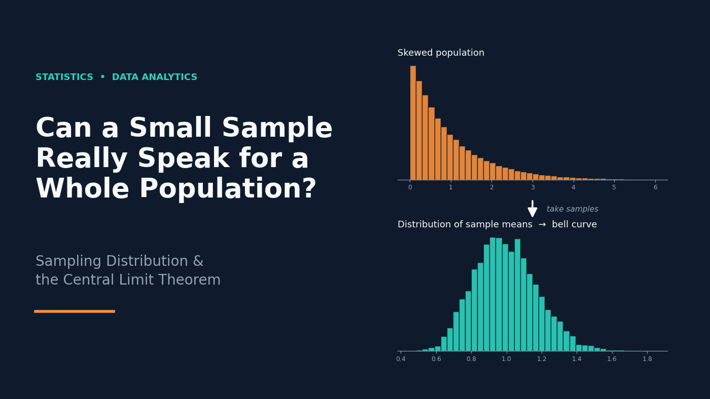

# Can a Small Sample Really Speak for a Whole Population?

### Sampling Distribution & the Central Limit Theorem



A beginner-friendly walkthrough of how a small sample can tell us about a whole population. It uses a small household-salary example, some math, and Python simulations.


---

## What the blog covers

1. **Why we need sampling:** collecting data from a whole population is often impossible
2. **Population vs. sample:** parameters (μ, σ²) vs. statistics (X̄, s²)
3. **Sampling distribution of the sample mean:** taking repeated samples from a 15-point salary dataset
4. **Unbiased estimator:** proof that E(X̄) = μ
5. **Variance and standard error:** Var(X̄) = σ²/n and SE = σ/√n
6. **Effect of sample size:** the distribution gets narrower as n increases
7. **Central Limit Theorem:** an experiment using an Exponential population (n = 5, 30, 100)
8. **Why the normal distribution matters:** the 68-95-99.7 rule and 95% confidence intervals

## Project structure

```
├── Sampling_Distribution_And_Central_Limit_Theorem.md   # Blog text
├── code_file.ipynb                                      # Jupyter notebook with all the code
├── Cover_image.png                                      # Medium cover image
├── python_images/                                       # Plots generated by the notebook
│   ├── population_data.png
│   ├── 1_sample_mean.png
│   ├── 10_sample_mean.png
│   └── pt1.png ... pt5.png                              # CLT experiment plots
├── other_images/                                        # Non-code images used in the blog
│   ├── 68-95-99.png
│   └── summary.png
└── readme.md
```

## Tech used

- Python
- NumPy
- Matplotlib
- Seaborn
- Jupyter Notebook

## How to run the code

1. Clone or download this folder.
2. Install the libraries:
   ```bash
   pip install numpy matplotlib seaborn jupyter
   ```
3. Open the notebook:
   ```bash
   jupyter notebook code_file.ipynb
   ```
4. Run the cells in order. The plots are regenerated, and the CLT experiment uses `np.random.seed(42)` so results are reproducible.

## Key takeaways

- A single sample mean can be far from the population mean, but the **average of many sample means** lands very close to it.
- The sample mean is an **unbiased estimator** of the population mean.
- The **standard error** shrinks as the sample size grows: SE = σ / √n.
- By the **Central Limit Theorem**, the distribution of sample means becomes approximately normal for large n, even when the population is skewed.

## Author

**Mansi Bramta**

Linkedin: https://www.linkedin.com/in/mansi-bramta-65358741b

Medium Account: https://medium.com/@mansibramta12

Kaggle: https://www.kaggle.com/code/mansibramta/sampling-distribution-the-central-limit-theorem

